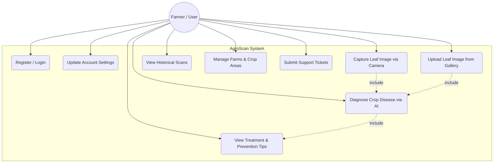
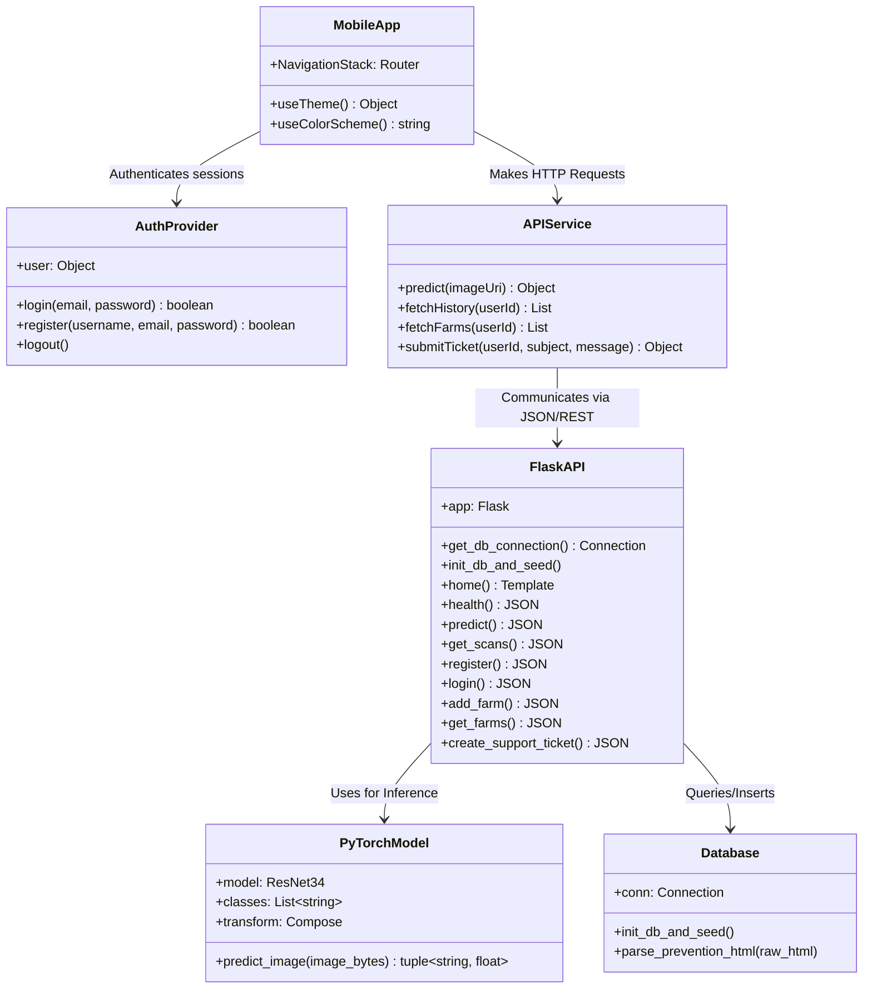
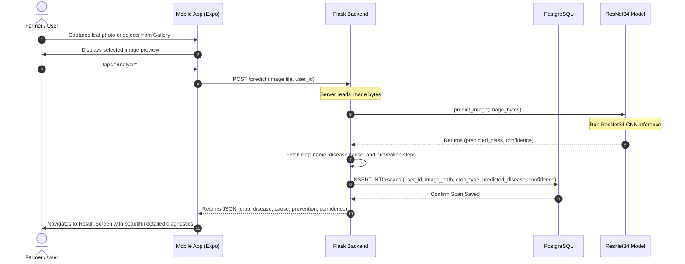
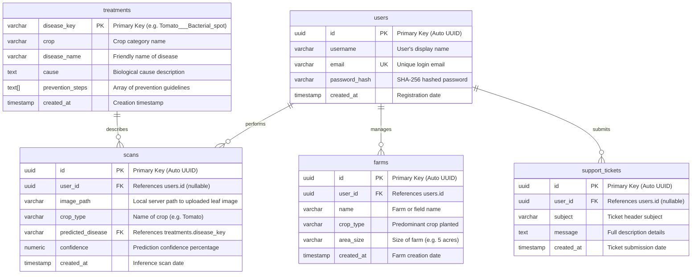

# AgroScan UML & System Diagrams

This document contains the UML and system architecture diagrams for the AgroScan project, written in **Mermaid** syntax. You can view these interactively inside VS Code (using the Markdown Preview) or directly on GitHub.

---

## 1. Use Case Diagram
This diagram shows the interactions between the **Farmer / User** and the AgroScan system.



---

## 2. Class Diagram
This diagram outlines the logical components and classes of the Flask Backend API and the React Native Mobile app.



---

## 3. Sequence Diagram (Scan & Diagnosis Flow)
This diagram illustrates the step-by-step communication process when a user scans a leaf.



---

## 4. Entity Relationship Diagram (ERD)
This diagram shows the complete relational schema of your active **PostgreSQL** database.



---

## How to Render and View These Diagrams

1. **In VS Code (Recommended)**:
   * Open this file (`docs/diagrams.md`).
   * Press **`Ctrl + Shift + V`** (or click the **Open Preview** button in the top right corner of VS Code).
   * VS Code will automatically render all the Mermaid diagrams interactively!

2. **On GitHub**:
   * Simply push this file to your GitHub repository. GitHub natively renders Mermaid blocks inside markdown files directly in the browser.

3. **Mermaid Live Editor**:
   * Copy the code block starting with ````mermaid` and paste it into the [Mermaid Live Editor](https://mermaid.live).
